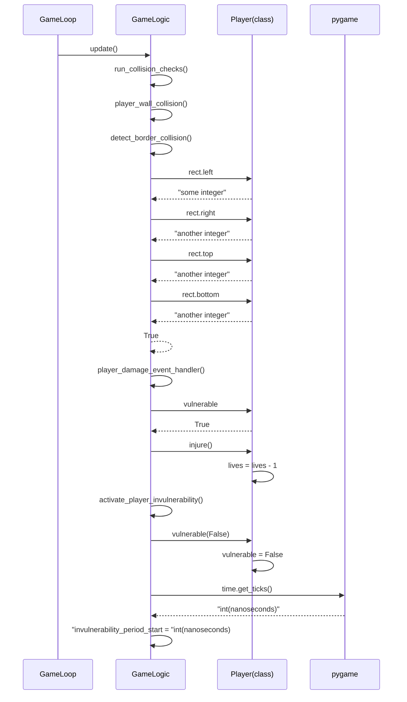

# Architecture Description

## Structure

The "game_engine package" is basically just the src folder for now,
but might get seperated into its own folder later on as the project
gets developed further. Utilities package doesn't exit as of now either,
but will likely be added in some form later on when I start working on DB
functionalities. The diagram still describes the basic idea behind the
the structure as of now.

## Functionality examples

### Player takes damage from touching a game border

