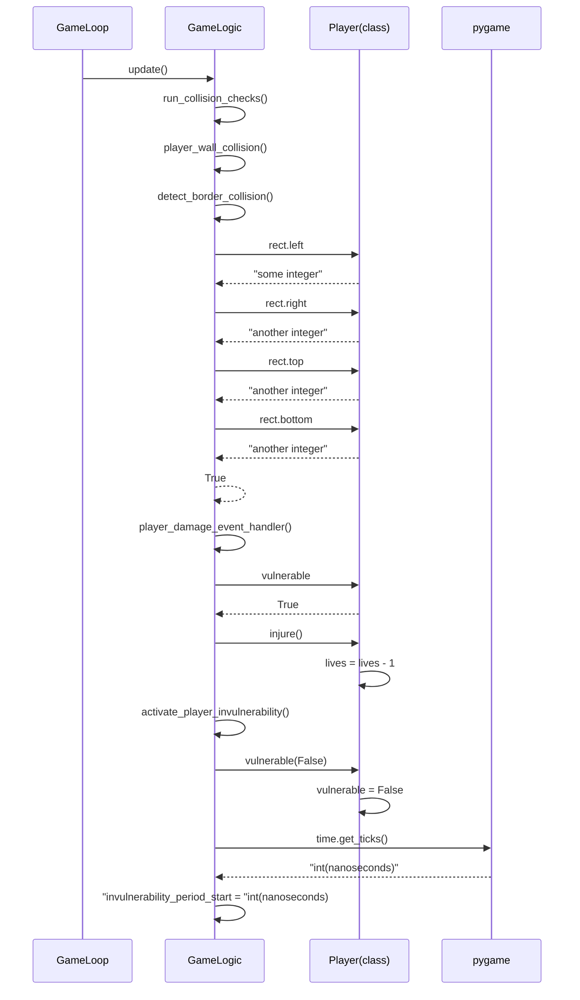

# Architecture Description

## Structure

The "`game_engine`package" contains all the base game logic. Sprites are game objects that have
contain some minor detail about their state and functionality that can be used by `Gamelogic`.

The `user_interface` doesn't actually exist inside its own package and the classes are currently
directly in the src folder. They will be refactored later.

The `utilities` package doesn't exist either as it only has one helper script.
The diagram describes the intended structure of the project.

## Game Engine

`GameState` class holds the majority of the information about the game state. it creates and keeps a
reference to sprites and other classes that need information from sprites can access them through
game state.

`GameLogic` uses the information and methods from game state and sprites to carry out the primary
functionality of the game itself. Sprites and game state provide tools to update parts of them
but GameLogic is where it is decided when and how those tools are accessed. For example the `player`
has `lives` and provides the method `injure` to reduce those lives as needed. Game Logic keeps references
to some sprites for easier access as it needs to manipulate and access their information frequently
GameState is still the main class that's responsible for these objects
GameLogic combines most of its functionality into an `update` method which can then be called
by `GameLoop` to keep the logic running each game iteration.

`GameLoop` refers to game logic to update the game as described above. It has a reference to Clock
and EventQueue classes which are mostly just minor encapsulations of pygame functionality to make
testing easier. `Renderer` provides methods for GameLoop to update the visuals of the game.

## User Interface

The `Renderer` class is responsible for the real-time rendering of objects it is passed by other classes.
Renderer requires access to GameState so it knows which screen to render. If the Game is over
renderer will render the correct screen.

`UITextController` is responsible for creating and updating text `Surfaces` that it can then pass
down to Renderer for rendering. UITextController needs access to `GameState` so it can update
text objects during gameplay as required. Text is only updated when its related status changes in GameState
otherwise UITextController will keep passing Renderer a previously created version of the text so it
doesn't have to recreate text during every iteration which can become expensive.

## Utilities

Contains only the `image_handler` module currently. The main purpose is to load and convert png
files from the assets folder which can then be rendered in the game. Sprites also base
their size on the dimensions of the png images loaded by the image loader. image_handler has also
functionality to help transform some of the images.

## Sprites

`Sprites` inherit the
[pygame.sprites.Sprite](https://www.pygame.org/docs/ref/sprite.html#pygame.sprite.Sprite)
class which simplifies operations like collision detection for `GameLogic`. In addition
to the inherited pygame sprite features the game sprites contain some basic information
and functionality that can be used by game logic. For example. `Gems` have value, `Player` has lives
`Enemies` have movement direction and speed. They also provide methods to do something with or
manipulate this information.

## Functionality examples

### Player takes damage from touching a game border

A sequence diagram showcasing the logic behind the previously mentioned
event in which the player receives damage.

## Issues

All issues below have been fixed. This section will be updated later

~~No permanent saves\
\
The game doesn't currently have any functionality to save players high scores. This is a key
feature that will be implemented soon.\
\
Game logic keeps running\
\
The game logic keeps running in the background even during the game over screen.
Visually this doesn't affect the user in any way, but it is unnecessary.\
\
No configurability\
\
The game has some configuration options for gameplay behavior and difficulty implemented in
the code, but as of now there's no way for a regular user to access them without just changing
the source code.~~
