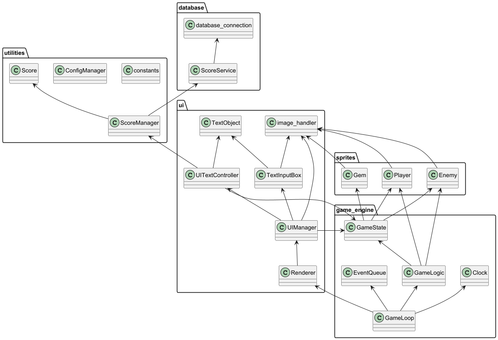

# Architecture Description

## Structure

Note the dependency between ConfigManager and database_connection is not visible on the diagram.

The "`game_engine`package" contains all the base game logic. Sprites are game objects that
contain some minor detail about their state and functionality that can be used by `Gamelogic`.

The `ui` package contains most of the classes that directly affect the game's visual elements.

`sprites` are a bit of an exception in that they handle a little bit of gameplay and UI logic
due to how they are designed in pygame. They mostly just contain tools for either game logic or
rendering that other classes can utilize for updating the sprite's game state and visual state.

The `utilities` package contains useful general utilities like constants used by the program
or it contains `Manager` classes that are used to abstract IO operations away from the
rest of the program.

The `database` package contains is meant for the `Service` classes that directly interact
with the database inside and a connection script that hands out the connection to the database
to classes that need it.

## Game Engine

The `GameState` class holds the majority of the information about the game state. It creates and keeps a
reference to sprites and other classes that need information from sprites can access them through
game state. `UIManager`, `UITextController`, and `GameLogic` depend on GameState.

`GameLogic` uses the information and methods from the game state and sprites to carry out the primary
functionality of the game itself. Sprites and game state provide tools to update parts of them
but GameLogic is where it is decided when and how those tools are accessed. For example the `player`
has `lives` and provides the method `injure` to reduce those lives as needed. GameLogic keeps references
to some sprites for easier access as it needs to manipulate and access their information frequently
GameState is still the main class that's responsible for these objects
GameLogic combines most of its functionality into an `update` method which can then be called
by `GameLoop` to keep the logic running each game iteration.

`GameLoop` refers to game logic to update the game as described above. It has a reference to `Clock`
and `EventQueue` classes which are mostly just minor encapsulations of pygame functionality to make
testing easier. `Renderer` provides methods for GameLoop to update the visuals of the game and
currently also passes pygame events to `UIManager`

## User Interface

The `Renderer` class is responsible for the real-time rendering of objects. It uses
update method from UI manager to update the state of the UI each iteration
and also gets objects that need to be rendered with pygame's display surface.

`UITextController` is responsible for creating and updating text Surfaces that can then be passed
down to Render for rendering. UITextController needs access to `GameState` so it can update
text objects during gameplay as required. Text is only updated when its related status changes in
GameState otherwise UITextController will keep passing Renderer a previously created version
of the text so it doesn't have to recreate text during every iteration which can become expensive.
UI text controller provides a getter method that accepts a string to describe which group is needed
for access so they can be rendered. All the usable constants are found in the `constants` module
under the `GROUP` enum.

`UIManager` Has access to all Surface creating classes so that it can create a collection
of "blit" that can be passed down to Renderer for rendering. Currently, these are just
gameplay and game-over states. It also has access to pygame events so it can update the
state of the UI elements as needed. UIManager requires access to `GameState` so it can know
which Surface collections it needs to pass down for rendering.

The `TextObject` class contains the information of text to be rendered such as location on the screen,
text, and pygame's Font object. It utilizes the Font Object to recreate a surface with its text
and provides an update method for updating the text manually. This simplifies the task of
`UITextController` and `TextInputBox`

`TextInputBox` Is a bit of an outlier class that contains some logic that could technically
fall under UITextController. However, it is Designed as a modular class that
responsible for most of its own logic and state handling so that it can be utilized in multiple
Ui screens more easily if needed. It provides methods for updating its state and getting its
renderable surface.

The `image_handler` module contains some basic abstraction between pygame and the game
and simplifies loading images correctly. It has some minor features for scaling
and changing images. Technically image handler could also fall under utilities as it
loads images from the disk from the asset folder, but since it's mostly related to UI elements
and visual components its location under `ui` makes sense.

## Sprites

`Sprites` inherit the
[pygame.sprites.Sprite](https://www.pygame.org/docs/ref/sprite.html#pygame.sprite.Sprite)
class which simplifies operations like collision detection for `GameLogic`. In addition
to the inherited pygame sprite features the game sprites contain some basic information
and functionality that can be used by game logic. For example. `Gems` have value, `Player` has lives
`Enemies` have movement direction and speed. They also provide methods to do something with or
manipulate this information. The sprites don't require one-by-one explanation as they are
rather similar in functionality and their roles are rather self-explanatory just by name alone.

## Utilities

`ConfigManager` is used for creating and accessing the configuration file under the config folder.
Config will create a default config if one isn't inside the config folder already otherwise its
create config method won't do anything unless called with `force=True` in which case it will
override the existing config with default settings. Most of the classes that require information
from the config don't have a direct dependency on it. The information is acquired in an initialization
script and passed down to the classes that need the information. As one exception
`database_connection` creates a direct instance of ConfigManager to get the filename of the
database.

`ScoreManager` is an abstraction class that gets information from `ScoreService` and then provides
that information to the `UITextController` The idea is that ScoreManager basically functions as an
API so that UITextController doesn't have to know where the information is received from.
It could be possible to implement ScoreService without a database using just a CSV file or
any other resource like online storage and then just provide the expected functionality to ScoreManager.
ScoreManager expects to receive the information in an already sorted order, but this could easily
be rewritten by just sorting the internal list of objects manually. The necessary sorting logic
is already upheld by the `Score` class.

`Score` is a class that contains the basic elements of score information (name, level, points, timestamp)
and contains implementation for  `__lt__` and `__eq__` to make comparing and sorting score objects simple.
it can provide the data one by one or together as tuples.

`constants` module contains enums and some global constant variables to make logically grouped
access to different variables that can be used by multiple modules For example all the directory
paths are stored as constants and accessible to any module that might need the information.
This makes updating the folder structure simple as you only need to change the path
in the enum variable rather than everywhere it is being used.

## Database

`database_connection` is a simple class that just provides the `sqlite3.Connection` object to
any module that might require it

`ScoreService` Is a class that handles direct SQLite queries for accessing and adding score information
into the database Currently there are two tables `players` which have a unique constraint on their name
and have a one-to-many relation to the `scores` table. Only has functionality for adding scores
or getting them all at once. `get_scores` provides a list of tuples with the player name
and the score information. The method sorts the score objects directly with the SQL query
in descending order by points and ascending order by datetime string.

## Functionality examples

### Player takes damage from touching a game border

A sequence diagram showcasing the logic behind the previously mentioned
event in which the player receives damage.

## Issues

The Renderer class currently works as an intermediary class between ui and game_engine packages.

Both UIManager and GameLoop need to handle pygame events to function and right now they are passed
through Renderer which is not ideal. UI manager also requires information from the GameState class
which creates awkward dependencies between the classes.

It would be better to put Renderer under UI manager so GameLoop can pass events to it directly.
This would simplify the dependencies.
