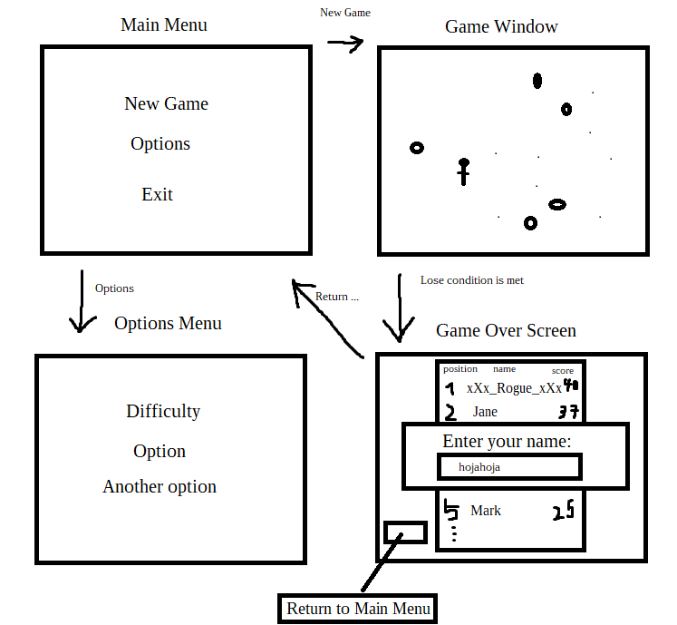
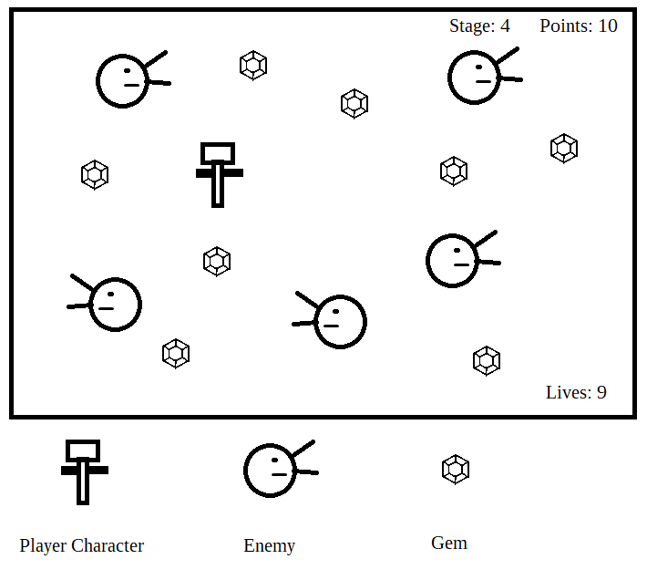

# Requirements Specification

## Purpose

A recreation of an obscure classic game called Jewel Thief. The main idea is to
use the mouse to move a character while collecting items and avoiding hostile
characters on the screen.

## Users

Initially, there will not be any user accounts. Score tracking and a "top
players" list might later be implemented with player profiles that anyone can
create. As of now, players are just unique identifiers inside the high-score database.
Each player's name is connected to their score in the data, but there is no visual
representation of this in the game yet.

## User interface

> [!NOTE]
> This section about the user interface is here as a reference point
> in case I want to create the missing features later after the course is over.

The main menu will be the first view. The game will start when the player clicks
"New Game". The game over-menu will come up when the loss condition of the game
is met. Options menu will be included if there is time to create some adjustable
settings.

Game Window and Game Over Screen are implemented, but Main Menu and Options
Menu are not. The game will directly jump into the Game Window when started.
The player can quit the game by pressing <kbd>ESC</kbd> and restart it
by pressing <kbd>F4</kbd>.

There are some adjustable settings in the game, but they are only accessible by manually
editing a `config.ini` file.

## Game window

A rough concept of the main game view

## Basic functionality

### Gameplay mechanics

- [x] Player character

    - [x] Replaces the mouse cursor inside the game window and can be moved with the
      mouse.
    - [x] Touches gems that are visible on the screen to collect points.
    - [x] Has a set number of lives that can be lost one by one when taking damage.
    - [x] Takes damage from touching an enemy character or the screen borders.
    - [x] Has a short invulnerability window after taking damage. The character will
      appear opaque when invulnerable.
    - [x] Character changes direction when moving left or right.

- [x] Enemy Character

    - [x] Moves diagonally on the game screen.
    - [x] Changes direction after touching a screen border.
    - [x] Can pass through other enemy characters without an issue.
    - [x] Touching a gem won't affect the enemy or the gem.
    - [x] Damages the player when the player object touches the enemy.
    - [x] Keeps spawning as game stages go up.
    - [x] Can increase its movement speed when certain criteria are met.
    - [x] Small movement animation

- [x] Basic logic

    - [x] Each stage will load with collectible gems.
    - [x] Starts with a few slowly moving enemies.
    - [x] When the player collects all visible coins, the next stage begins and the
      game will spawn another enemy.
    - [x] At certain stages, the speed of newly spawned enemies will be increased.
      Existing enemies will keep their current speed to vary the gameplay.

### Other functionality

- [x] The game will form a score based on gems collected.
- [x] The player can enter their name at the end of the game. The name and score will be
  kept in a database.
- [x] You can see the top scorers after the game has ended.

### User Interface

- [x] End game screen.
- [x] Gameplay screen.
- [ ] Start menu.
- [ ] Options menu.

## Further development

Some ideas for extending the game once the basic functionality is working:

- [ ] Different types of gems with different score values.
- [ ] Different types of enemies with altered movement behaviors.
- [x] Difficulty settings: Either allow some control over enemy behavior or create
  different difficulty presets with adjusted movement speeds and spawn rates
  for enemies.
- [ ] Real stages: A stage will have different visual styles (background images) and
  different types of gems and enemies that are specifically associated with the
  stage.

- [ ] Player profiles
    - [ ] Instead of writing their name at the end players can create profiles.
    - [ ] A profile will track games played, time played, all scores, furthest stage
      reached and potentially any other information
    - [ ] The options menu will have a player profile screen with the information
      listed above.

- [ ] Allowing the player to change the game resolution.
- [ ] Decoupling Game speed from the game clock and allowing players to select FPS.
- [ ] Sound effects.
