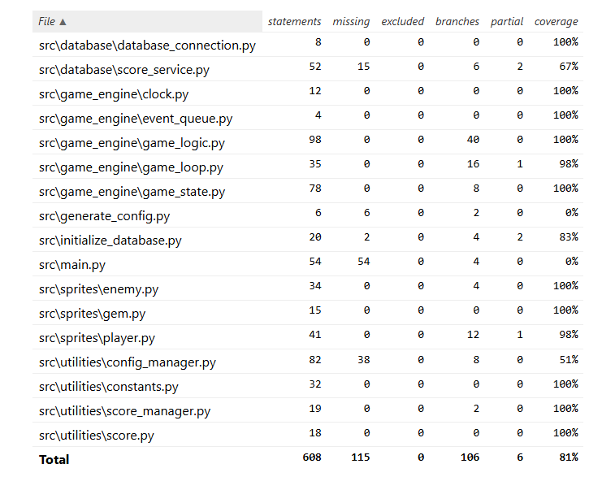

# Test Documentation

The main game engine logic contains quite a few unit tests. Some of the unit tests
check cross-functionality for integration testing, but many of them use mock objects to ensure
that specific calls are being made without having to rely on the dependencies.
System testing is done manually by making by playing the game with and trying out the different
configurations. UI testing is done manually.

## Unit and integration testing

### GameEngine

The `ClockTest` class mocks pygame's clock object and tests that it returns expected values when called.
`EvenTQueueTest` just tests that it's being called when an event is passed down.

`GameLogic` class is mostly tested with stub objects that mimic required functionality, but
instead use logic relevant to testing like counting how many times some method has been called.
All game sprites and GameState use stub variants of the objects.

`GameState` uses python's mock library to patch out the image handler with a MagickMock object.
For the player class, this just disables loading images from files unnecessarily. The mocked image loader
for the enemy sprite also returns a Surface object so that enemy positions can be tested. Gem
sprites are mocked for population testing. The real sprite isn't necessary just to test that
population logic is being called correctly.

`GameLoop` mocks its GameLogic, Renderer, Clock, and EventQueue dependencies. Tests
make sure the dependencies are called correctly and that the loop responds to pygame events correctly
by giving the mocked EventQueue a list of events and inserting pygame events into it manually for
testing. One test is commented out for checking out that the test methodology is actually functional
and results in an infinite loop when no pygame quit event is being fed into the queue.
An infinite loop would break the tests so it is commented out until needed again for testing.
A more elegant solution would require writing tests using multithreading or similar methodologies.

### Sprites

Sprite tests are mostly just testing straight forward functionality of their tools with one exception.
Enemy class tests that its animation logic functions correctly using a mocked dictionary.
All sprites mock the image handler so it doesn't cause issues during testing as loading an
image is not necessary for the testing. The images do have pygame test surfaces which contain
location data for sprites however testing how movement or collision affects the game state is relevant in
GameState and GameLogic tests rather than individual sprites, and so they are tested in game_engine
tests.

### Utilities

`ConfigManager` tests, test some basic functionality by reading and writing options into a test file.
The tests create a local config.ini inside the testing folder. Some tests recreate the test file
to make sure the tests are stateless. Tests that change the file change it back after use.

Due to time constraints, some of the edge cases and exception handling remain untested in unit tests.
All of these except IO Errors have been tested manually by trying the document with incorrect data.
Most of these cases are handled so that the game will still attempt to run with some default settings
even if the file can't be accessed at all. ConfigManager is designed to recreate a config
file if it doesn't find one So an IO Error would mostly result from file access issues or faulty
storage devices.

`ScoreManager` Is a rather simple abstraction of ScoreService's functionality and has simple
tests for its logic like testing the correct sorting order of scores. One datetime object
is patched with a magick mock as datetime objects use the now() method with microseconds enabled which is
difficult to test accurately without setting specific values.

`Score` is a straightforward class with straightforward functionality tests and the `constans` module
doesn't need testing. It does have 100% coverage due to being called by other classes or by being
used in tests directly when dealing with specific values that are available in the module.

### Database

`ScoreService` has a class-wide setup method that creates a local database file in the test folder
The setup method checks if the test location has a db file and deletes it. It then uses the project's
database initialization script to create a new database file with empty tables. This way
the test suite starts with a clean slate and clear space from the disk since the DB could keep
growing with constant insertions and deletions.

The method scope setup and tear-down classes insert specific rows into the table before each test
and delete all rows after each test to keep the tests stateless.

Due to time constraints, some of the error handling and edge cases of ScoreService aren't covered in
tests some manual testing has been done directly with and sqlite3 interpreter to ensure things
function as expected.

### Test coverage

The ui module has been left out of the coverage report. Test coverage is currently 81%.

Game engine logic is pretty extensively tested and sprites have most of their user scenarios covered.
Utilities and some database classes have somewhat lacking testing as explained in their specific sections,
but even they have at least the base functionality tested.

Initialization scripts like main.py generate_config.py aren't tested. main.py handles creating
instances and handing out dependencies to classes that need them. While the class isn't unit tested
nothing would work in System testing if the main script was significantly broken. generate_config.py has
simplistic functionality that is tested elsewhere and running it manually on the command line is
enough to see that it functions. initialize_database.py script is covered mostly because it is used by
the ScoreService test script to create the testing database for its tests.

## System testing

Installation instructions have been attempted on multiple different systems Including Windows
and different Linux distributions.

#### Functionality

System testing was done mostly manually. All initialization scripts have been run numerous
times manually. Gameplay elements have been tested and many different config.ini configurations have been
tested. config.ini has been tested with incorrect and missing data and the game is made to run
on default settings if it can't load something from the config file. The game will not start
if the database has not been initialized or if the DB connecting cannot find correct tables due to the tables missing
or the file missing altogether the game will close. A message will be printed in the terminal asking
the user to read the manual on how to init the database file this has also been tested. This has also
been tested manually.

Most of the manual test were done on Windows and A Linux virtual machine. Some were done on a remote desktop
version of Cubbli Linux to ensure that base functionality works there.

All the checked functionality in [requirements specification](requirements_specification.md)
has been tested and verified to be functional with manual testing.

## Issues

The configuration file is somewhat lacking and some of the options inside the configuration do not
do anything. This is because the features have not been implemented yet. The user is informed
that this functionality isn't currently functional in the comments of the .ini file itself.

Some testing is lacking. Particularly classes that deal with the config.ini file and the database
require more extensive unit testing and only have basic use cases covered.
