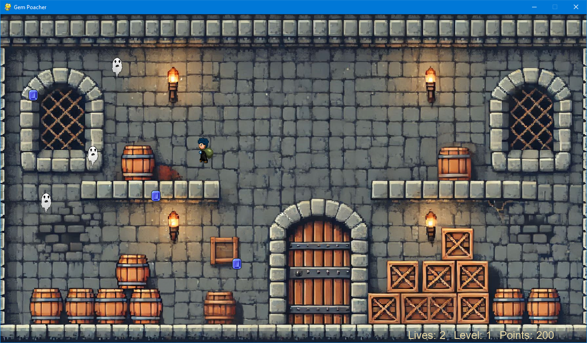
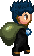
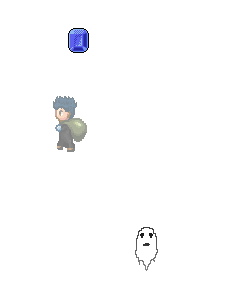

# User Manual

Get the latest version of from [releases](https://github.com/hojahoja/Gem-Poacher/releases).

## Installing and running the game

Unpack the downloaded and run these commands inside Powershell or your preferred shell on Linux. \
[Poetry](https://python-poetry.org/docs/) has to be installed for these to work

These commands need to be executed from the root folder of the project.

### Install dependencies

```sh
poetry install
```

### Run the game

```sh
poetry run invoke start
```

## Basic controls

When your mouse cursor is inside the game screen it will be replaced with the player character.
You move the player just by moving the mouse.

You can restart the game by pressing  <kbd>F1</kbd>

You can exit the game by pressing <kbd>ESC</kbd>

## Gameplay



The goal of the game is to collect the little gems on the screen and collect points
while avoiding enemies. Move the player character toward a gem with your mouse to
pick it up. Each collected game will give you points.

If you touch an enemy character your player character will lose a life.
Your character will also lose a life from touching the screen borders of the game.

After your character loses a life your character will turn invulnerable for one second.
You will not lose any lives when touching enemies or the screen border while the player
character is invulnerable. The player character will be transparent when invulnerable to
damage. The game will also start with a short invulnerability period so you don't lose a
life if an enemy randomly spawns on you right at the start of the game.

The game ends when the life counter turns to 0.

#### Player character



#### Gem


#### Enemy


#### Player is invulnerable


