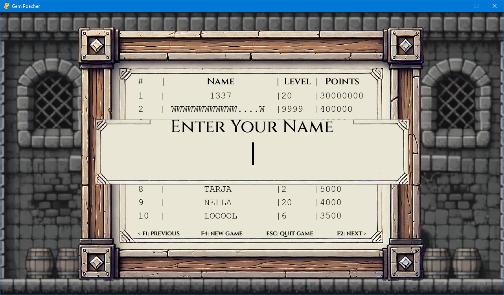
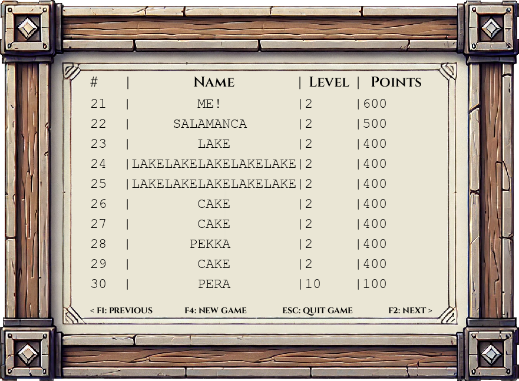

# User Manual

## Sections

1. [Installing and running the game](#installing-and-running-the-game)
2. [Configuration file](#configuration-file)
3. [Gameplay](#gameplay)
4. [Game Over Screen](#game-over-screen)
5. [Basic controls](#basic-controls)

Get the latest version of from [releases](https://github.com/hojahoja/Gem-Poacher/releases).

## Installing and running the game

Unpack the downloaded and run these commands inside Powershell or your preferred shell on Linux. \
[Poetry](https://python-poetry.org/docs/) has to be installed for these to work

These commands need to be executed from the root folder of the project.

### Install dependencies

```sh
poetry install
```

### Initialize database

This will also create a config file if one doesn't exist and then
create a high score database according to the filename set inside the
`config.ini`.

> [!CAUTION]
> Running this command on an already existing on an already initialized database will wipe it clean.\
> Only run this command if you want to clear you current database or create a new one.

```sh
Poetry run invoke create-databse
```

### Run the game

```sh
poetry run invoke start
```

### Troubleshooting: Recreate config.

If you run into issues with the config file or just want to regenerate default
settings you can either delete the `config.ini` in `src/config` and run the game.
or you can run:

```sh
Poetry run invoke create-config
```

## Configuration file

### Game settings

Basic configuration

You can adjust difficulty settings. Difficulty settings adjust
the amount of points you get for each gem. You can't earn points in Custom difficulty.

Easy $ = \times 1$\
Medium $ = \times 2$\
Hard $ = \times 3$\
Ludicrous $ = \times 4$

The name of the difficulty in the setting file is not case-sensitive.

```ini
[GAME SETTINGS]
; options: easy, medium, hard, ludicrous, custom
difficulty = MEDIUM
```

### Database settings

The Database is used for storing player high scores. The file is found inside
`src/database`.

You can choose the database name by adjusting the name with database path.
Name and extension don't really matter as long as there is it in some kind of format
with a dot in the middle. Make sure to run `Poetry run invoke create-databse` if you
want to create a new database.

If you just want to rename an old functioning one
then just renaming the file and adding changing the new name in the config is enough.
Don't run `create-database` on an already usable database unless you want to wipe all the data.

```ini
[DATABASE SETTINGS]
; filename of the db file in src/database folder
database path = score.db
```

### Custom difficulty settings.

These will only apply if you've set the difficulty to `CUSTOM` in `[GAME SETTINGS]` Their functionality
is explained in the comments inside the ini file:

```ini
[CUSTOM DIFFICULTY SETTINGS]
; these settings will be used if you choose custom difficulty in game settings
; thresholds change something after reaching the specified level
; set first threshold to 1 if you want these values from the start of the game
dynamic difficulty first threshold = 2
dynamic difficulty second threshold = 6
; how values changes after reaching specific thresholds
; default value before reaching first threshold is 1
enemy speed threshold 1 = 2
enemy speed threshold 2 = 3
; 5 gems are spawned before a threshold is reached
; after the first threshold gems spawn at rate of level + value set
gem spawn rate threshold 1 = 4
gem spawn rate threshold 2 = 4
player lives = 9
```

## Gameplay


The goal of the game is to collect the little gems on the screen and collect points
while avoiding enemies. Move the player character toward a gem with your mouse to
pick it up. Each collected game will give you points. The value is adjusted depending
on your difficulty. Specific modifiers are listed in the [Game Settings](#game-settings) section.

If you touch an enemy character your player character will lose a life.
Your character will also lose a life from touching the screen borders of the game.

After your character loses a life your character will turn invulnerable for one second.
You will not lose any lives when touching enemies or the screen border while the player
character is invulnerable. The player character will be transparent when invulnerable to
damage. The game will also start with a short invulnerability period so you don't lose a
life if an enemy randomly spawns on you right at the start of the game.

The game ends when the life counter turns to 0.

#### Player character


#### Gem


#### Enemy


#### Player is invulnerable


## Game Over Screen



After the game ends you will see the scoreboard and a text entry box which allows you to
enter your name. Highest score gets the first place. New scores that have the same point value
as an older score will always be positioned below the older score.

## Basic controls

When your mouse cursor is inside the game screen it will be replaced with the player character.
You move the player just by moving the mouse.

### Always available

<kbd>F4</kbd> Restart game

<kbd>ESC</kbd> Exit game

### Game Over Screen

You can start typing your name when you see the blinking cursor in the textbox:

<kbd>⏎ ENTER</kbd> Add your name and score after typing it or remove text entry box if the textfield is empty.


> [!NOTE]
> Your score won't be saved if you don't enter a name.

### When text entry box isn't visible

<kbd>F2</kbd> or <kbd>→</kbd> Next scoreboard page.

<kbd>F1</kbd> or <kbd>←</kbd> Previous scoreboard page.



