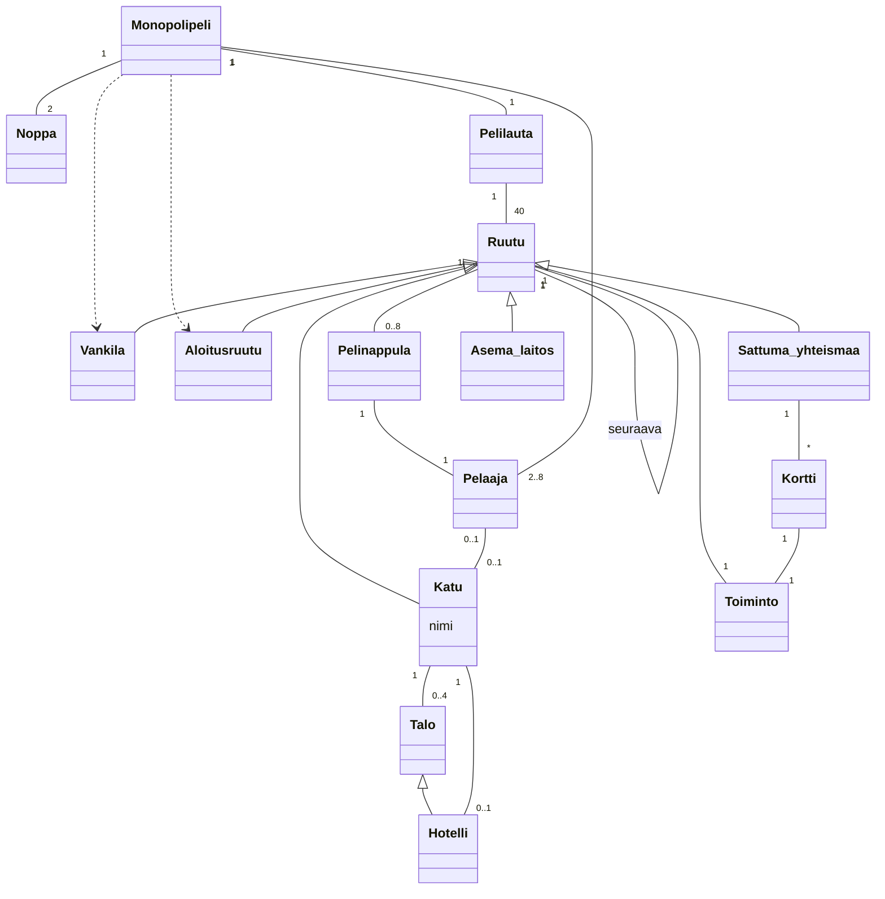

## Monopolin Luokkadiagrammi

```mermaid
 classDiagram
    Monopolipeli "1" -- "2" Noppa
    Monopolipeli "1" -- "1" Pelilauta
    Monopolipeli ..> Vankila
    Monopolipeli ..> Aloitusruutu
    Pelilauta "1" -- "40" Ruutu
    Ruutu "1" -- "1" Ruutu : seuraava
    Ruutu "1" -- "0..8" Pelinappula
    Pelinappula "1" -- "1" Pelaaja
    Pelaaja "2..8" -- "1" Monopolipeli
    Ruutu <|-- Aloitusruutu
    Ruutu <|-- Vankila
    Ruutu <|-- Sattuma_yhteismaa
    Ruutu <|-- Asema_laitos
    Ruutu <|-- Katu
    class Katu{
      nimi
    }
    Ruutu "1" -- "1" Toiminto
    Kortti "1" -- "1" Toiminto
    Sattuma_yhteismaa "1" -- "*" Kortti
    Talo <| -- Hotelli
    Katu "1" -- "0..4" Talo
    Katu "1" -- "0..1" Hotelli
    Pelaaja "0..1" -- "0..1" Katu
```
